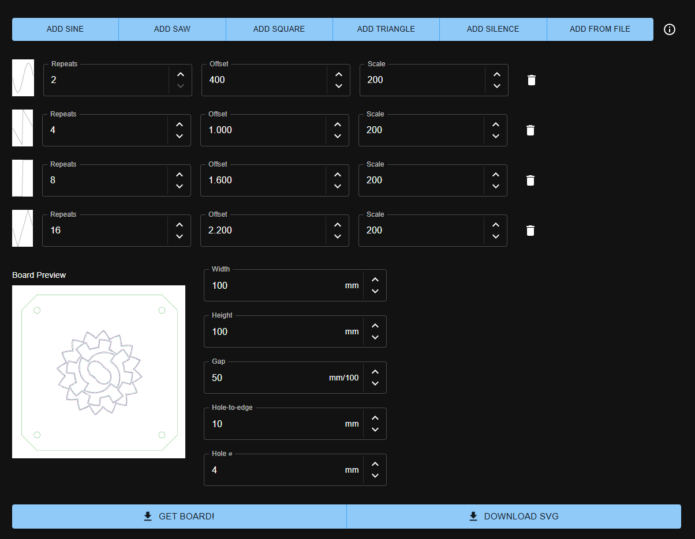
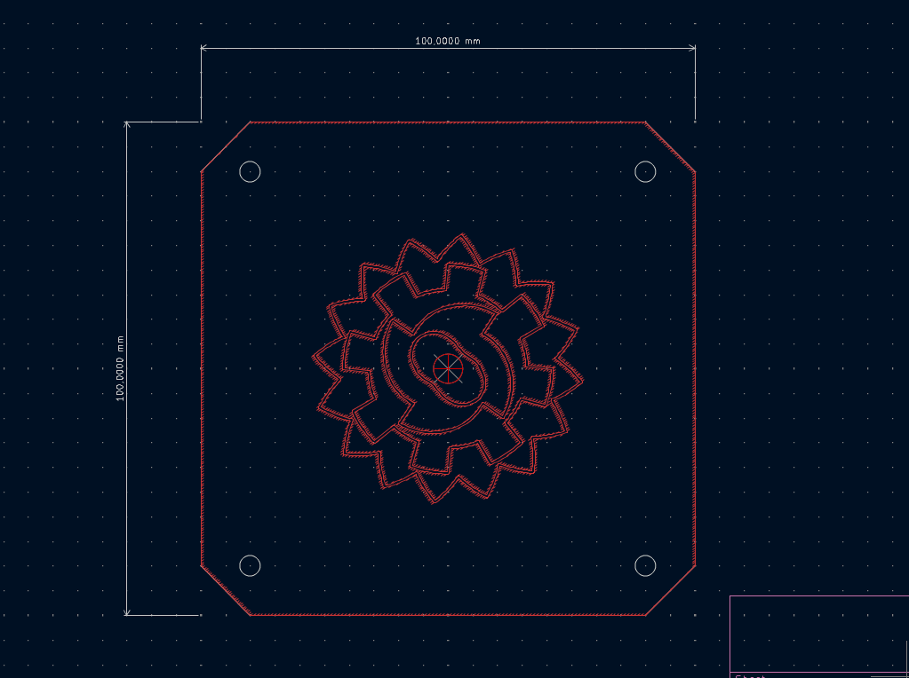
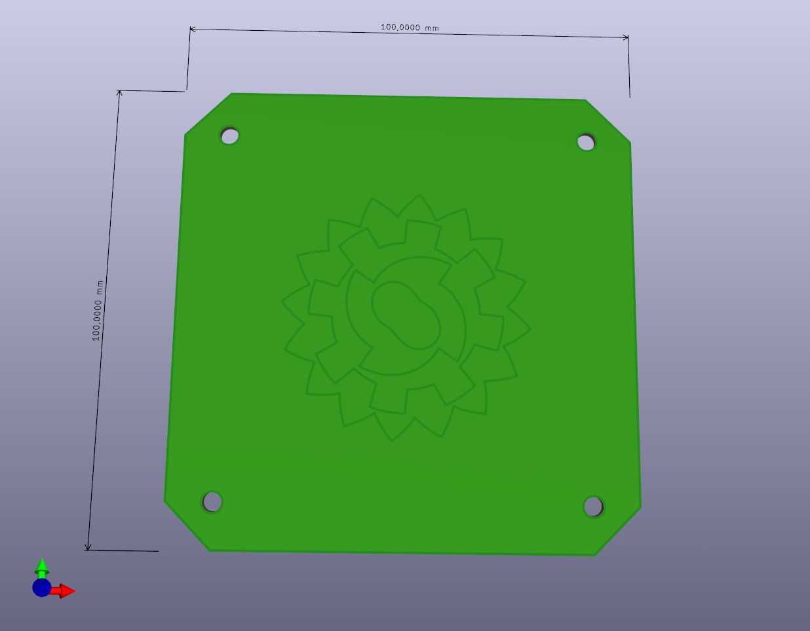

# Round wave thingy

Proof of Concept generating kicad files based on waveform data

## [Published version](https://herrzatacke.github.io/svg-wave/)

## How it looks
User interface

KiCAD PCB view

KiCAD 3D view

